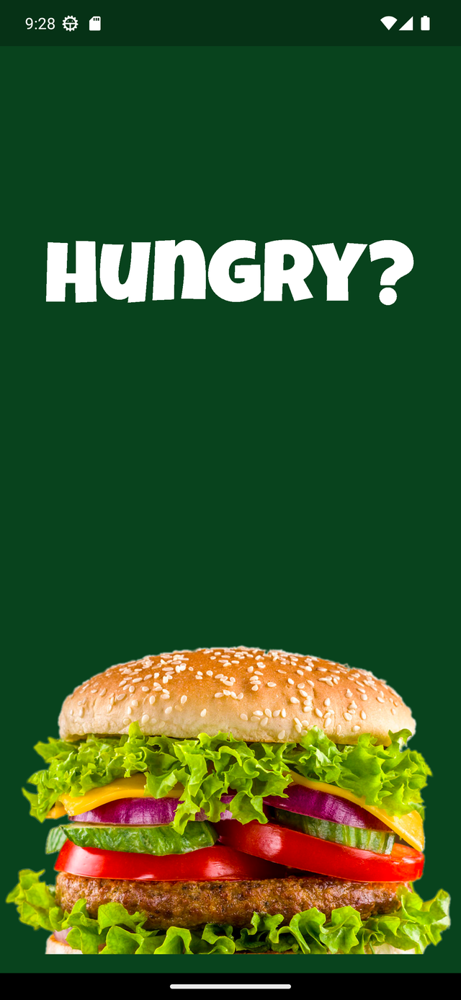
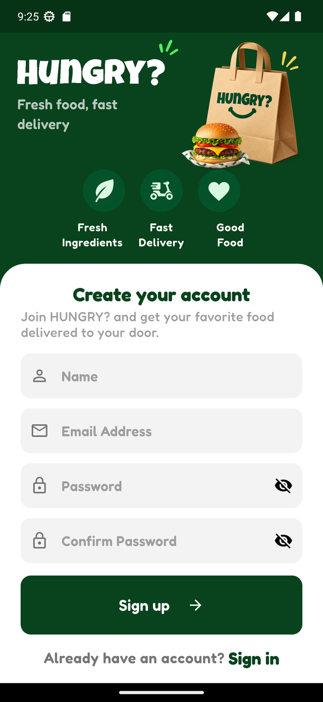
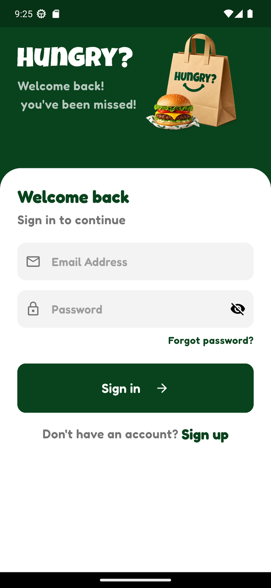
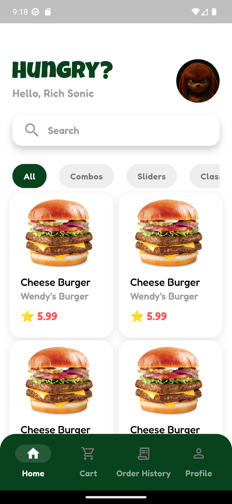
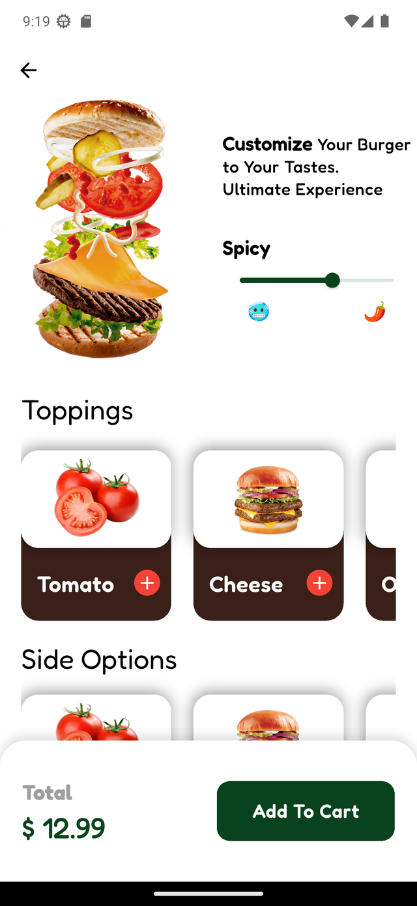
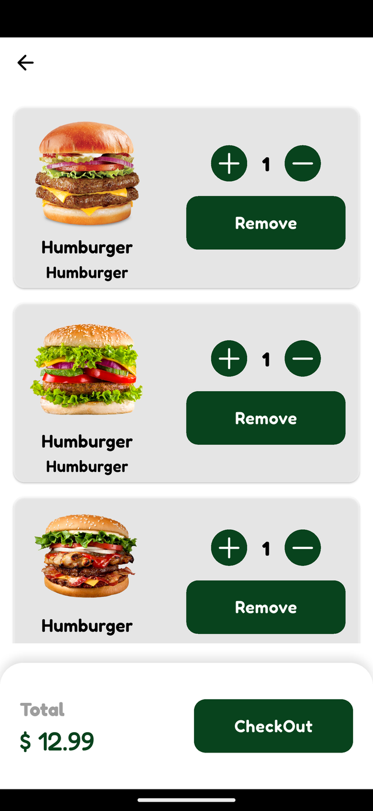
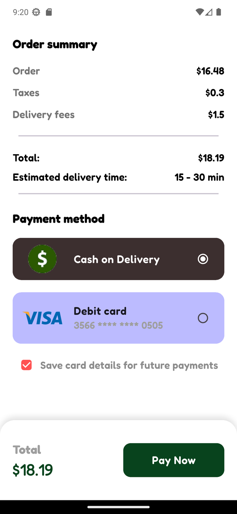
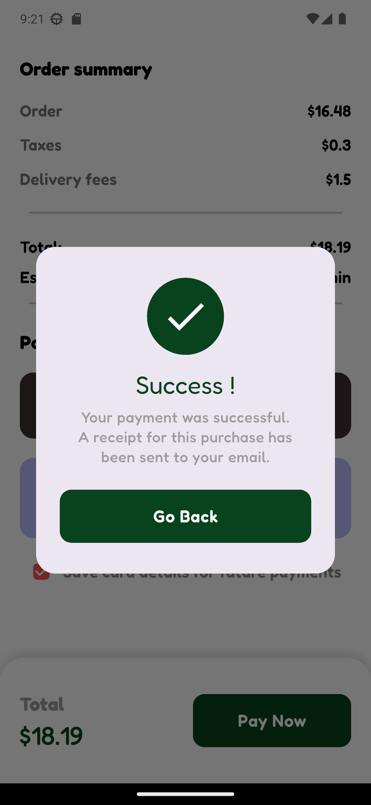
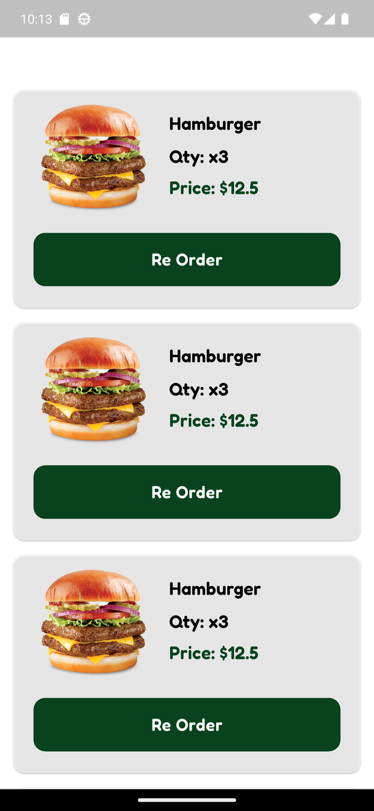
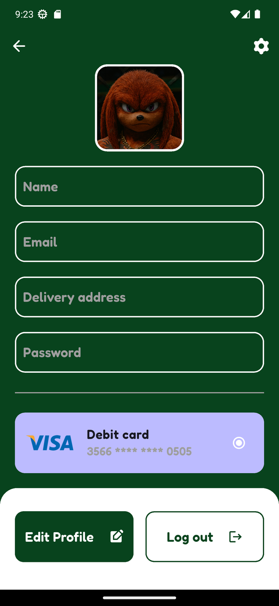

# Hungry 🍔

**Hungry** is a food‑ordering mobile app built with **Flutter**. This repository is the **UI / pages branch** — every screen of the ordering journey is designed, built, and wired together with in‑app navigation, backed by static in‑memory data. The **next milestone** is connecting these screens to a real **REST API** (designed and tested in **Postman** first, then integrated screen by screen).

The whole experience follows one brand identity: a deep‑green (`#08431D`) palette, the rounded **Fredoka** typeface, and a fully responsive layout that scales across screen sizes.

---

## 🖼️ Screenshots

<div align="center">

### Onboarding

<table>
  <tr>
    <td align="center">
      
      <br/><sub><b>Splash</b></sub>
    </td>
    <td align="center">
      
      <br/><sub><b>Sign Up</b></sub>
    </td>
    <td align="center">
      
      <br/><sub><b>Sign In</b></sub>
    </td>
  </tr>
</table>

### Browse &amp; Customize

<table>
  <tr>
    <td align="center">
      
      <br/><sub><b>Home</b></sub>
    </td>
    <td align="center">
      
      <br/><sub><b>Product Details</b></sub>
    </td>
    <td align="center">
      
      <br/><sub><b>Cart</b></sub>
    </td>
  </tr>
</table>

### Checkout

<table>
  <tr>
    <td align="center">
      
      <br/><sub><b>Checkout</b></sub>
    </td>
    <td align="center">
      
      <br/><sub><b>Payment Success</b></sub>
    </td>
    <td align="center">
      
      <br/><sub><b>Order History</b></sub>
    </td>
  </tr>
</table>

### Account

<table>
  <tr>
    <td align="center">
      
      <br/><sub><b>Profile</b></sub>
    </td>
  </tr>
</table>

</div>

---

## ✨ Features

- **Animated splash** — logo and hero burger fade, scale, and slide into place on launch.
- **Authentication UI** — Sign Up (name, email, password, confirm) and Sign In screens with:
  - inline form validation (email must contain `@`, password ≥ 9 characters, name ≥ 3 characters, matching confirm password),
  - show / hide password toggles and a *Forgot password?* link.
- **Home** — branded header with greeting and avatar, a search field, a horizontal category selector (**All / Combos / Sliders / Classics**), and a two‑column food grid.
- **Product details** — hero image, description, an interactive **Spicy** slider (🥶 → 🌶️), and horizontally scrolling **Toppings** and **Side Options** selectors, with a sticky *Add to Cart* bar showing the running total.
- **Cart** — editable line items with quantity steppers and remove, plus a sticky total bar that leads to checkout.
- **Checkout** — itemized order summary (subtotal, taxes, delivery fee, total, estimated delivery time), selectable payment methods (**Cash on Delivery** / **Visa debit card**), a *Save card details* toggle, and an animated **payment‑success dialog**.
- **Order history** — past orders with image, quantity, and price, plus one‑tap **Re‑Order**.
- **Profile** — avatar, editable account fields (name, email, delivery address, password), saved card, and *Edit Profile* / *Log out* actions.
- **Bottom‑navigation shell** — Home / Cart / Order History / Profile kept alive with an `IndexedStack`.

---

## 🎨 Design System

Styling lives in one place so every screen stays consistent:

- **Colors** — a single `AppColors` source of truth built around the brand green `#08431D`.
- **Typography** — a global `TextTheme` (Google Fonts **Fredoka**). Screens never hard‑code a `TextStyle`; they read from `TextTheme.of(context)` and use `.copyWith(...)` for one‑off tweaks.
- **Responsiveness** — [`flutter_screenutil`](https://pub.dev/packages/flutter_screenutil) with a `375 × 812` design canvas, so paddings, radii, and font sizes scale proportionally across devices.
- **Assets** — SVG logo/icons via [`flutter_svg`](https://pub.dev/packages/flutter_svg); consistent spacing via [`gap`](https://pub.dev/packages/gap).

---

## 🧩 Tech Stack

| Area | Choice |
| --- | --- |
| Framework | Flutter (Dart SDK `^3.7.2`), Material 3 |
| Responsive sizing | `flutter_screenutil` |
| Typography | `google_fonts` (Fredoka) |
| Vector assets | `flutter_svg` |
| Spacing | `gap` |
| State | Local `setState` (no backend yet) |
| Architecture | Feature‑first: `app/` · `core/` · `features/` · `shared/` |

---

## 📂 Project Structure

```
lib/
├── main.dart                     # App entry point
├── splash_view.dart              # Animated splash screen
├── app/
│   ├── app.dart                  # Root MaterialApp (theme + ScreenUtil init)
│   └── navigation/
│       ├── main_shell.dart       # Bottom-nav shell (IndexedStack over the 4 tabs)
│       └── widgets/              # Custom rounded navigation bar
├── core/
│   ├── constants/                # app_colors.dart, app_images.dart (asset paths)
│   ├── network/                  # dio_client, api_service, api_error, api_exceptions (API step — placeholders)
│   ├── theme/                    # app_theme.dart, app_text_theme.dart (Fredoka TextTheme)
│   └── utils/                    # pref_helper.dart (token/session — API step)
├── features/
│   ├── auth/                     # login, signup, profile views + validators & widgets
│   ├── cart/                     # cart view, card item, cart model
│   ├── checkout/                 # checkout view, payment tiles, success dialog
│   ├── home/                     # home view, header, search bar, categories, card
│   ├── order_history/            # order history view
│   └── product/                  # product details, spicy slider, toppings
└── shared/
    └── widgets/                  # custom_button, custom_text_field, bottom_total_bar, ...
```

---

## 🚀 Getting Started

```bash
git clone https://github.com/Ismail-Shaer/hungry_app.git
cd hungry_app
flutter pub get
flutter run
```

> Requires the Flutter SDK (Dart `^3.7.2`). Run `flutter doctor` to confirm your setup.

---

## 🔌 Next Step — API Integration (Postman‑first)

This branch is intentionally **UI‑only**: all data (products, cart items, orders, payment cards) is static and in‑memory. The networking layer is already **scaffolded** under `core/` and waiting to be implemented:

| File | Planned role |
| --- | --- |
| `core/network/dio_client.dart` | Configured Dio instance — base URL, headers, interceptors |
| `core/network/api_service.dart` | Typed endpoints (auth, products, cart, orders) |
| `core/network/api_error.dart` | Normalized error/result model |
| `core/network/api_exceptions.dart` | Exception → user‑facing message mapping |
| `core/utils/pref_helper.dart` | Token / session persistence |

**Plan:** design and test each endpoint in **Postman**, then integrate feature by feature — **auth → products → cart → orders** — swapping the mock data sources for live API calls.

---

## 🔄 Current Status

- ✅ All primary screens built and navigable end‑to‑end
- ✅ Centralized theme (colors + Fredoka typography) and responsive layout
- ✅ Form validation on the auth screens
- 🚧 Data is mock / in‑memory — no persistence yet
- 🚧 Networking layer scaffolded but not implemented
- ⬜ No automated tests yet

---

## 🛠️ Roadmap

- [ ] Wire screens to a REST API with Dio (Postman‑first)
- [ ] Introduce state management (Provider / Riverpod / Bloc) once data is dynamic
- [ ] Real cart math (per‑item totals, taxes, delivery) instead of fixed values
- [ ] Authentication with token/session persistence
- [ ] Live search and category filtering
- [ ] Unit and widget tests

---

<div align="center">
Built with Flutter 💚 by <a href="https://github.com/Ismail-Shaer">Ismail Shaer</a>
</div>
